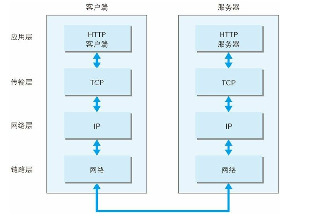
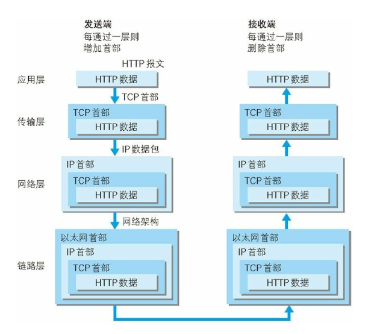

为了理解HTTP，我们有必要事先了解一下TCP/IP协议族。

统舱使用的网络（包括互联网）是在TCP/IP协议族的基础上运作的，而HTTP属于它内部的一个子集。

### 1.3.1 TCP/IP协议族
计算机与网络设备要相互通信，双方就必须基于相同的方法。比如，如何探测到通信目标、由哪一边先发起通信、使用哪种语言进行通信、怎样结束通信等规则都需要事先确定。而我们把这种规则成为协议。

协议中存在各式各样的内容。从电缆的规格到IP地址的选定方法、寻找异地用户的方法】双方建立通信的顺序，以及Web页面显示需要处理的步骤等。

### 1.3.2 TCP/IP的分层管理
TCP/IP协议族里最重要的一点就是分层。YTCP/IP协议族按层次分别分为以下4层：应用层、传输层、网络层和数据链路层。

把TCP/IP层次化是有好处的。如果护理网只由一个协议统筹，某个地方需要改变设计时，就必须把所有部分整体替换。而分层之后只需要把变动的层替换即可。把各层之间的接口部分规划好之后，每个层次内部的设计就能够自由改动了。

TCP/IP协议族各层的作用如下：
* **应用层**：决定了想用户提供应用服务时通信的活动。
  TCP/IP协议族内预存了各类通用的应用服务，比如FTP和DNS服务就是其中两类。HTTP协议也处于该层。
* **传输层**：对上层应用层提供处于网络连接中的两台计算机之间的数据传输。
  在传输层有两个性质不同的协议：TCP（Transmission Control Protocol，传输控制协议）和UDP（User Data Protocol，用户数据报协议）。
* **网络层**：处理在网络上流动的数据包。数据包是网络传输的最下数据单位，该层规定了通过怎样的路径到达对方计算及，并把数据包传送给对方。
  与对方计算机之间通过多台计算机或网络设备进行传输时，网络层所起的作用就是在众多的选项内选择一条传输路线。
* **链路层**：用来处理连接网络的硬件部分。包括控制操作系统、硬件的设备驱动、NIC（网课）、及光纤等物理可见的部分。硬件上的范畴均在链路层的恶作用范围之内。

### 1.3.3 TCP/IP通信传输流
利用TCP/IP协议族进行网络通信时，会通过分层顺序与对方进行通信。发送端从应用层往下走，接收端则从链路层往上走。

以HTTP为例，通信流程如下：
1. 作为发送端的客户端在应用层发出一个想看某个Web页面的HTTP请求。
2. 在传输层把从应用层处接收到的数据进行分割，并在各个报文上打上标记须好以及端口号后转发给网络层。
3. 在网络层，增加作为通信目的地的MAC地址后转发给链路层。这样一来，发往网络的通信请求就准备齐全了。
4. 接收端的服务器在链路层接收到数据，按序网上层发送，一直到应用层。