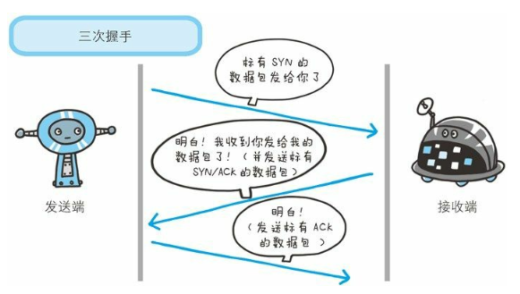

### 1.4.1 负责传输的IP协议
IP（Internet Protocal）网际协议位于网络层，几乎所有使用网络的系统都会用到IP协议。

IP协议的作用是把各种数据包传送给对方。而要保证正确传送的，其中两个重要条件是IP地址和MAC地址。

IP地址致命了节点被分配到的地址，MAC地址是指网卡所属的固定地址。IP地址可变换，MAC地址基本不会变。

IP间的通信依赖MAC地址。在网络上，通信的双方通常是经过多台计算机和网络涉别中专才能连接到对方。而在进行中转时，会利用下一站中转设备的MAC地址来搜索下一个中转目标。这时会采用ARP协议。Arp协议是一种用来解析地址的协议看，根据通信放的IP地址就可以反查出对应的MAC地址。

### 1.4.2 确保可靠的TCP协议
TCP位于传输层，提供可靠的字节流服务。

TCP协议为了更容易传送大数据才把数据进行分割，而且TCP协议能够确认数据最终是否送达到对方。

为了准确无误将数据送达目标处，TCP协议采用了三次握手策略。握手过程中使用了TCP标志 ---- SYN（synchronize）和ACK（acknowledgement）。

发送方首先发送一个带有SYN标志的数据包给对方。接收端收到后，回传一个带有元SYN/ACK标志的数据包以示传达确认信息。最后，发送端再回一个带有AK标志的数据包，代表握手结束。

TCP协议还有其他各种手段来保证通信的可靠性。

