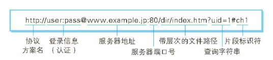

URL正是使用Web浏览器等访问Web网页时需要输入的网页地址。

### 1.7.1 统一资源标识符

URI是Uniform Resource Identifier的缩写：
* Uniform：规定统一的格式可方便处理多种不同类型的文件。
* Resource：可标识的任何东西，如文档、图像、服务、等等。
* Identifier：标识符，用来标识资源的。

URI用字符串表示某一互联网资源，而URL表示资源的地点（互联网上所处的位置）。可见URL是URI的子集。

### 1.7.2 URI格式
