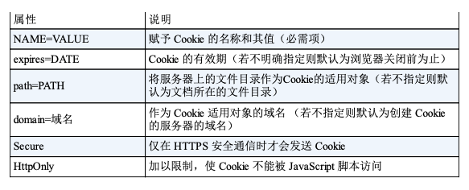

Cookie的工作机制是用户识别以及状态管理。Web网站为了管理用户的状态会通过Web浏览器，把一些数据临时写入用户的计算机内。接着当用户访问该Web网站时，可通过通信方式取回之前发放的Cookie。

调用Cookie时，由于可娇艳Cookie的有效期，以及发送方的域、路径和协议等信息，所以正规发布的Cookie内数据不会因来自其他Web站点和攻击者的攻击而泄露。

### 6.7.1 Set-Cookie
当服务器准备开始管理客户端的状态时，会事先告知各种信息。

Set-Cookie字段的属性：

### 6.7.2 Cookie
首部字段Cookie会告知服务器，当客户端想获得HTTP状态管瘤支持时，就会在请求中包含从服务器接收到的Cookie。

